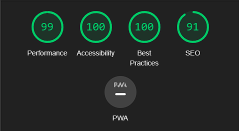

# PatternLight
PatternLight is a memorisation game which has a screen, a difficulty level indicator, an attempt indicator and 4 buttons which will light up randomly. The main objective is to wait for the sequence to finish, memorise it and then repeat it by clicking on the buttons.

The game is aimed at those who want to train and take care of their memory through a challenge that gets more difficult as you level up.

## Features
#### Existing Features
- Information screen:
    - Displays the name of the game at the top.
    - It offers the user the opportunity to watch a tutorial or start the game.
    - Displays feedback depending on whether the user hits, misses or has to start over.
    - Indicates when the sequence has been completed for the user to repeat.
    - Displays the highest level reached once you lose.
    

- Mini level display:
    - Displays the current level of difficulty.
    - Starts at level 1 by default.
    - There is no final level, the goal is to reach the highest level before losing.
    

- Tries Indicator:
    - Three hearts represent the chances you have before the game ends.
    - Every failure will turn off a heart.
    - If the game ends, the user will get the three hearts back.
    

- Buttons: 
    - Four interactive buttons.
    - Have a responsive design which adapts to different screen sizes to make the best use of space. 
    - They also show the sequence the user must follow to advance by means of coloured lights.
    - The order in which the buttons light up is random, making each game different.
    
#### Features Left to implement
- With enough time I would like to adjust and add a function that recovers a try with each success, so that the difficulty of the game is reduced.
### Testing
- I have confirmed that the design is responsive and adapts to different screen sizes.
- I have confirmed that the game displays the sequence that the user must follow correctly.
- I have confirmed that the main screen displays user feedback in response to their actions correctly.
- I have confirmed that each success raises one difficulty level appropriately. 
- Lives are reduced appropriately each time a failure is made.
- I have tested the game in several browsers such as Edge, Chrome, Safari and Firefox to make sure it is compatible and works fine in all of them.

### Validator Testing
- HTML
    - No errors were returned when passing through the official [W3C validator](https://validator.w3.org/nu/?doc=https%3A%2F%2Flsverry.github.io%2FPattern-Light%2F)

- CSS
    - No errors were found when passing through the official [(Jigsaw) validator](https://jigsaw.w3.org/css-validator/validator?uri=https%3A%2F%2Flsverry.github.io%2FPattern-Light%2F&profile=css3svg&usermedium=all&warning=1&vextwarning=&lang=en)

- JavaScript
    - No errors were found when passing through [JSHint JavaScript Validator](https://jshint.com/)

- Accessibility
    - I have confirmed that this project is responsive, adapts well to all standard screen sizes and there is sufficient contrast between background and text using the DevTools device toolbar: 
    

## Bugs
##### Solved bugs:
- When I deployed my project on GitHub pages, I discovered that the game didn't work properly (a button was not responding).
- I discovered that the problem was because I accidentally deleted line 58 of code while testing the program.
- I simply added the line again, which allowed to save the value of the button and the problem was solved.

- I also discovered that the function that displayed the sequence to the user behaved erratically (sometimes it was not possible to see the whole sequence).
- I discovered that the error was due to the inner function of displaySequence() calling itself infinitely.
- Solve this by placing an if statement to end the recursive call of the function when it reaches the end of the sequence.

### Unfixed bugs
No unfixed bugs

## Deployment
- This game was deployed on GitHub pages, here are the steps followed for deployment:
    - In the game repository, go to settings.
    - Once in settings, scroll down to the "Code and automation" section and click on the last option "Pages".
    - In "Source" select "deploy from a branch".
    - And below select the branch that contains your website and click on "Save".
    - Then a URL will be generated after a few minutes.
    The link to the game can be found here - [PatternLight](https://lsverry.github.io/Pattern-Light/)

## Credits

### Content
- The principle of the code for the first function to make the buttons responsive was taken from the [Code Institute Love Maths project](https://github.com/Code-Institute-Org/love-maths)

### Media
- The icons for the attempt indicator were taken from [Font Awesome](https://fontawesome.com/)
- The favicon icon was taken from [Font Awesome](https://fontawesome.com/)